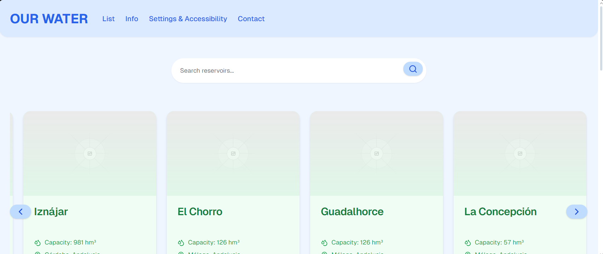
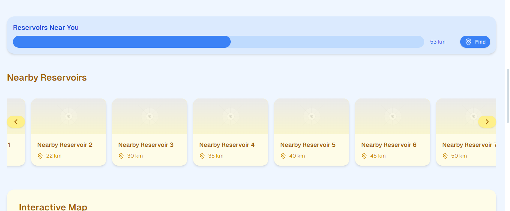
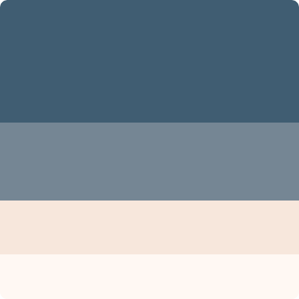
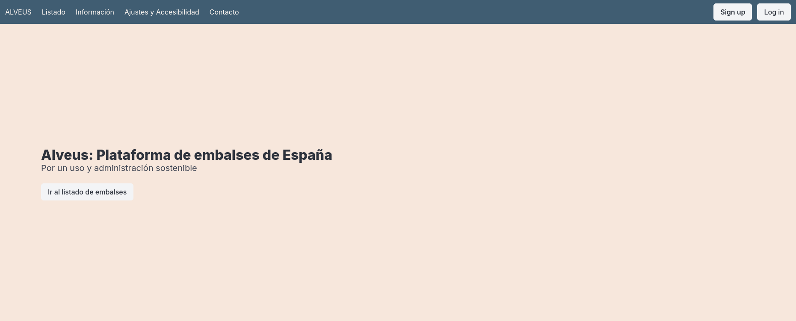
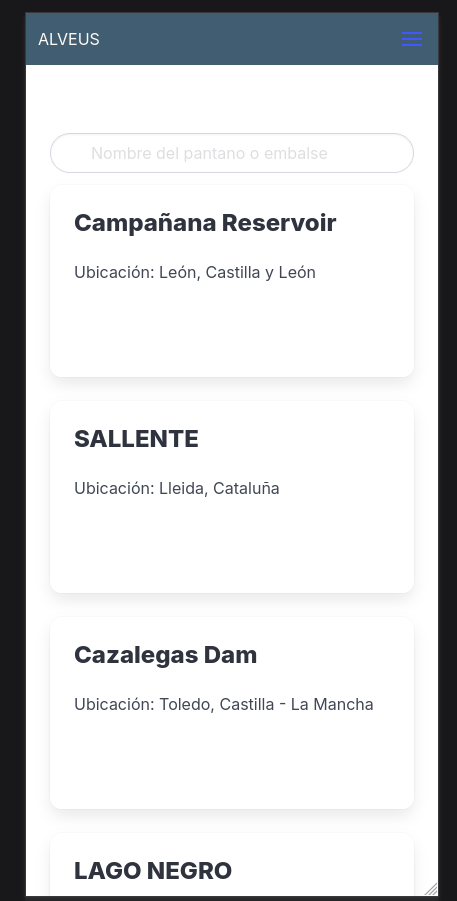
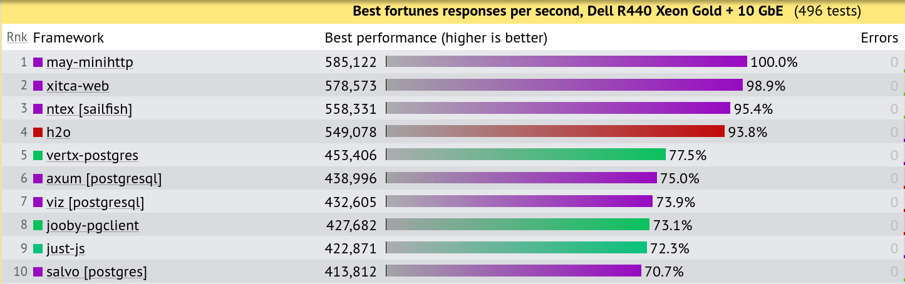
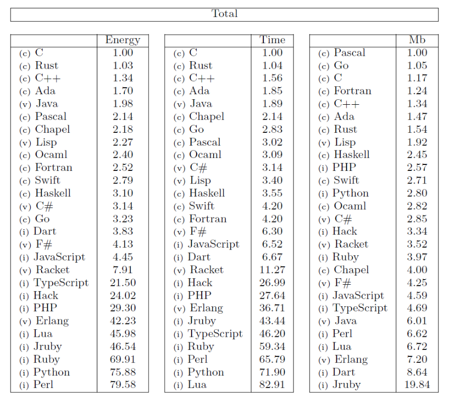
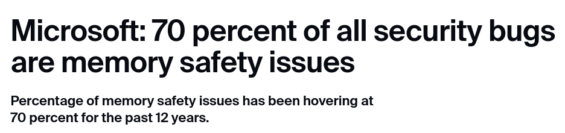
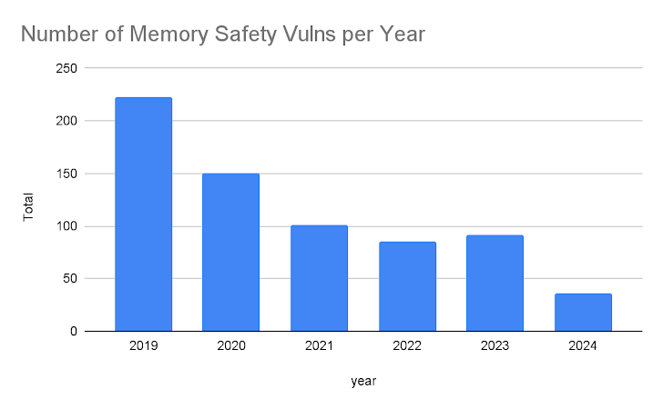

<style>
* {
    font-family: "FantasqueSansMono NFM";
}
</style>

# HACKONAUTAS


---
  
  

---

# Índice
- Arquitectura
    - Frontend
    - Backend
- El futuro


---

<style scoped>
* {
  color: #FFF;
}
</style>


# Arquitectura

---

- Modular
- Escalable
- Eficiente

```
[BBDD <-> BACKEND] <-> FRONTEND
```

---
<style scoped>
* {
  color: #FFF;
}
</style>


# Frontend

---

- Responsivo
- Reactivo
- Accesible

---



---



---

# Diseño




Diseño caracteristico, legible y claro


---



---



---

# ¿Por qué Svelte?

- Más fácil que otras alternativas
- Enfasis en la accesibilidad
- Simple, ligero, completo

---
<style scoped>
* {
  color: #FFF;
}
</style>


# Backend

---

# ¿Por qué Rust?


- Seguro
- Rápido
- Moderno


---



fuente: Tech Empower Fortunes 2023

---



<style scoped>
* {
    font-size: 9pt;
}
</style>

**fuente:** https://dl.acm.org/doi/10.1145/3136014.3136031

---





fuentes: Hacker News y Zdnet

---


# Base de datos
- API REST
- Oracle PL/SQL (funciones)
- Acceso granular, rápido y seguro

---
<style scoped>
* {
  color: #FFF;
}
</style>


# El futuro

---

- Tests de integración
- Visualización de datos
- Contenerización
- Analisis de datos
  - Sarima
- Mas opciones de accesibilidad
  - a11yproject
  - WCAG2

---

# ¡Muchas Gracias!

